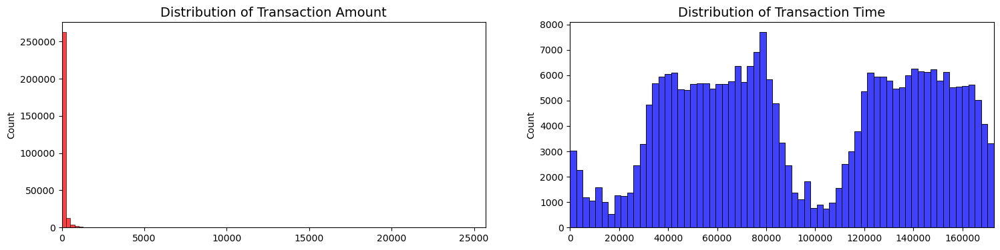
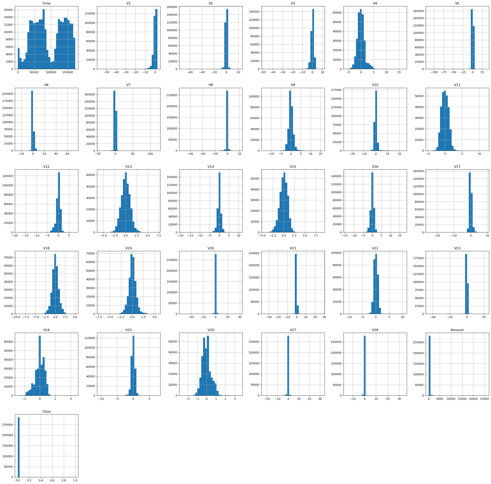
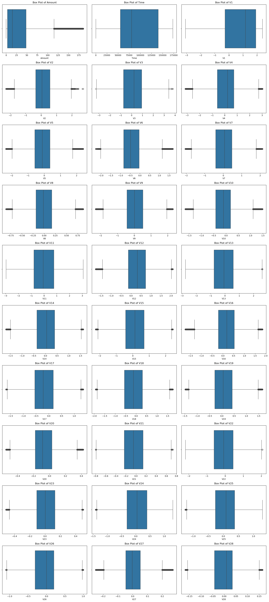
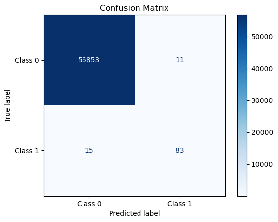

# PREDICTING CREDIT CARD FRAUD AGAIN
## Authors: Okky Rijanto, Sarita Rana, Elizabeth Yeo, Gibran Alvarez Aguilar, Gordon Geringas

### Summary
1. Data exploration

- There are no "Null" values in the dataset
- The transaction amount is small. The mean of all the transaction amounts is approx. $88.
- The dataset is highly imbalanced; 99.83% of the transactions were Non-Fraud while 0.17% of the transactions were fraud.
  
 

- The features other than "Amount" and "Time" have gone through a PCA transformation and were anonymized.

- Distributions:
  Visualizing the distributions of the "Transaction Time" and "Transaction Amount":

 

  Visualizing the distributions of all the features to check their skewness:
  
 
  
2. Data pre-processing

- Created box plots to visualize the outliers
  
 

- Removed outliers and duplicates
- Feature scaling: Since the other features have been scaled, we scaled the "Time" and "Amount" using StandardScaler.

### Machine Learning Architecture and Problem Domain motivation
   
Since the data is highly imbalanced, simpler models showed that, despite high accuracy, they did not perform well in fraud detection. Therefore, we explored multiple balancing techniques to improve the model's performance in detecting fraudulent transactions.

Pipelines Implemented:

Pipeline 1: Included SMOTE for data augmentation.
Pipeline 2: Used BalancedRandomForestClassifier, which incorporates an internal balancing mechanism.
Pipeline 3: Applied ADASYN for data augmentation.
Pipeline 4: Baseline model with stratified splitting of the dataset (ensuring the class distribution is maintained in both training and test sets).

Results:

Pipeline 1 (SMOTE):
Demonstrated a balanced performance with a focus on recall, which is crucial for detecting fraud cases.
f1_score: 0.8842105263157894

 

Pipeline 2 (BalancedRandomForestClassifier):
Had the lowest accuracy among the pipelines, suggesting that its internal balancing mechanism may have affected its overall classification ability.

Pipeline 3 (ADASYN):
Showed similar trends to SMOTE but with a different synthetic data generation approach.
f1_score: 0.8645833333333334

 

Pipeline 4 (Stratified Split):
The stratified split helped maintain the class distribution during model training and testing, leading to the highest F1 score of 0.968. This indicates that careful data splitting without additional balancing techniques can be highly effective, especially when the model naturally handles class imbalance well.
f1_score: 0.968421052631579

 

Confusion matrices were plotted for each pipeline, highlighting the performance in terms of true positives, true negatives, false positives, and false negatives.
The confusion matrix for Pipeline 4 showed strong performance, with well-balanced precision and recall, further supported by the stratified data split.

Conclusion:
Data balancing techniques like SMOTE and ADASYN generally improve the ability to detect fraud cases by enhancing recall. However, in this case, the baseline model with stratified data splitting outperformed others in terms of F1 score. This suggests that maintaining the natural distribution of classes during training can be more effective than applying synthetic data balancing, especially when using a model that handles class imbalance well.

7. XG Boost (Okky)
8. Data Augmentation using schmiddy (Gibran)
9. Logistic (Gibran)
10. AutoEncoders (Gibran)
11. GAN (Liz)

### Tuning Hyperparameters
To be completed

12. Conclusion
Which is the best model for highly imbalanced dataset? using SMOTE to scale the data prior to loading to XG Boost.
For imbalanced dataset, accuracy is not a good metric so we looked at the F1 score.
Logistic model has the highest F1 Score 0.81

### Limitations:
XG Boost: computational power limitation across most of the methods
GAN: generator and discriminator

### Criteria
We seek to train a model that minimizes [true fraud:predicted notfraud] and maximizes [truefraud : predicted fraud]. Undetected true fraud is strictly damaging to the financial health of the credit institution and clients. Predicting true fraud allows the institution to mitigate harms of fraud by locking the card out of any further transactions. To that extent, we seek a model that can perform better than 1:3 [true fraud:predicted notfraud] : [truefraud : predicted fraud].

### Training / Validation Strategy
To be completed

### Data Ethics Discussion
To be completed

### Individual Reflection Videos
* Okky Rijanto
* Sarita Rana
* Elizabeth Yeo
* Gibran Alvarez Aguilar
* Gordon Geringas

### Repo File and Folder Structures
* **Data:** Contains the raw, processed and final data. For any data living in a database, make sure to export the tables out into the `sql` folder, so it can be used by anyone else.
* **Experiments:** A folder for experiments
* **Models:** A folder containing trained models or model predictions
* **Reports:** Generated HTML, PDF etc. of your report
* **src:** Project source code
* README: This file!
* .gitignore: Files to exclude from this folder, specified by the Technical Facilitator

### Change log
2024-08-07 [Gordon] Added team-project-2 branch and set up README.md
