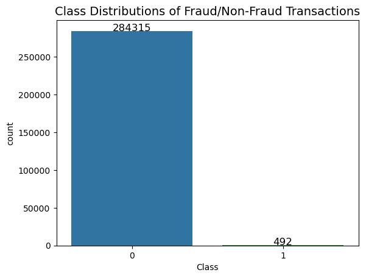

# PREDICTING CREDIT CARD FRAUD AGAIN
## Authors: Okky Rijanto, Sarita Rana, Elizabeth Yeo, Gibran Alvarez Aguilar, Gordon Geringas

### Summary
1. Data exploration

- There are no "Null" values in the dataset
- The transaction amount is small. The mean of all the transaction amounts is approx. $88.
- The dataset is highly imbalanced; 99.83% of the transactions were Non-Fraud while 0.17% of the transactions were fraud.

- The features other than "Amount" and "Time" have gone through a PCA transformation and were anonymized.

3. Data pre-processing (outliers removal, graphs) (Liz)
   
### Machine Learning Architecture and Problem Domain motivation
4. Stratify (Sarita)
5. SMOTE (Sarita)
6. XG Boost (Okky)
7. Data Augmentation using schmiddy (Gibran)
8. Logistic (Gibran)
9. AutoEncoders (Gibran)
10. GAN (Liz)

### Tuning Hyperparameters
To be completed

12. Conclusion
Which is the best model for highly imbalanced dataset? using SMOTE to scale the data prior to loading to XG Boost.
For imbalanced dataset, accuracy is not a good metric so we looked at the F1 score.
Logistic model has the highest F1 Score 0.81

### Limitations:
XG Boost: computational power limitation across most of the methods
GAN: generator and discriminator

### Criteria
We seek to train a model that minimizes [true fraud:predicted notfraud] and maximizes [truefraud : predicted fraud]. Undetected true fraud is strictly damaging to the financial health of the credit institution and clients. Predicting true fraud allows the institution to mitigate harms of fraud by locking the card out of any further transactions. To that extent, we seek a model that can perform better than 1:3 [true fraud:predicted notfraud] : [truefraud : predicted fraud].

### Training / Validation Strategy
To be completed

### Data Ethics Discussion
To be completed

### Individual Reflection Videos
* Okky Rijanto
* Sarita Rana
* Elizabeth Yeo
* Gibran Alvarez Aguilar
* Gordon Geringas

### Repo File and Folder Structures
* **Data:** Contains the raw, processed and final data. For any data living in a database, make sure to export the tables out into the `sql` folder, so it can be used by anyone else.
* **Experiments:** A folder for experiments
* **Models:** A folder containing trained models or model predictions
* **Reports:** Generated HTML, PDF etc. of your report
* **src:** Project source code
* README: This file!
* .gitignore: Files to exclude from this folder, specified by the Technical Facilitator

### Change log
2024-08-07 [Gordon] Added team-project-2 branch and set up README.md
